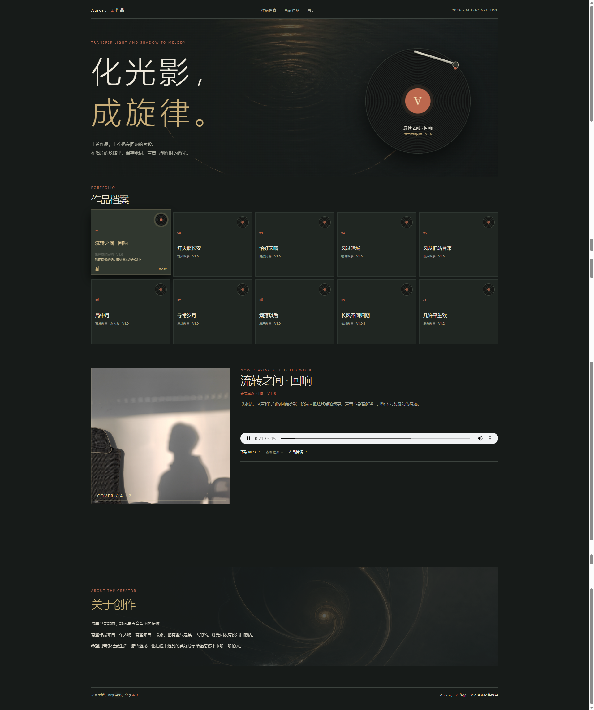

# Aaron，Z作品 · 音乐创作档案

## 在线预览

[打开音乐作品主页](https://aaronzhao84.github.io/music-portfolio/)

这是音乐创作主页的当前发布版本，包含 21 首作品、独立详情页、歌词、音频播放和 MP3 下载。

## 主页视觉预览




## 目录结构

```text
├─ index.html                 # 主页入口
├─ site-base.css              # 主页基础布局与色彩
├─ site.css                   # 主页交互与细节样式
├─ site-online-parity.css     # 与线上确认版一致的背景覆盖样式
├─ site.js                    # 主页播放、歌词、下载和详情页导航
├─ detail/                    # 21 首歌曲详情页
│  ├─ *.html
│  ├─ detail.css
│  ├─ detail.js
│  ├─ detail-data.js
│  └─ detail-lyrics.js        # 本地双击打开时的歌词兜底
├─ assets/
│  ├─ audio/                  # 作品音频
│  ├─ covers/                 # 详情页封面
│  └─ lyrics/                 # 格式化歌词文本
└─ preview_assets/            # 主页视觉素材与主页播放资源
```

## 当前功能

- 21 首作品按 Portfolio 顺序分页展示，支持持续扩展；
- 章节预览卡片支持进入下一页、返回上一页和最后一页的持续更新提示；
- 唱片播放与暂停、唱针和旋转动画；
- 主页播放、原生进度拖动、歌词自动展开与 MP3 下载；
- 支持上一首、下一首、顺序播放、随机播放、单曲循环和列表循环；
- 从主页进入对应歌曲详情页，并可返回主页；
- 详情页包含歌曲信息、试听、歌词、创作背景与共鸣、声音质地；
- 支持 GitHub Pages 和本地双击打开；
- 使用相对路径，资源保持清晰分层，不打包压缩。

## 本地预览

推荐使用支持 HTTP Range 的本地服务，以保证 MP3 可以边下载边播放并正常拖动进度：

```powershell
python serve_range.py
```

然后访问 `http://127.0.0.1:8765/index.html`。

## 部署说明

网站根目录必须同时包含 `index.html`、主页 CSS/JS、`detail`、`assets` 和 `preview_assets`。不要只上传 HTML 文件，否则图片、音频和歌词无法加载。
